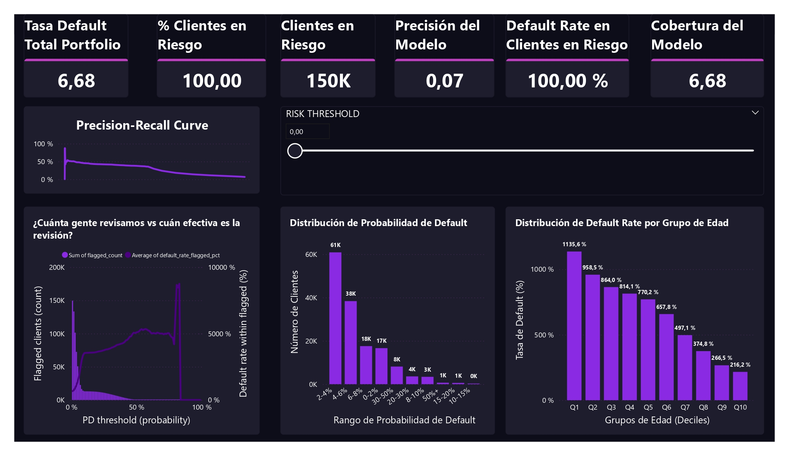

# 🏦 Credit Risk Analysis Dashboard


## 📊 Descripción del Proyecto


Dashboard interactivo de análisis de riesgo crediticio que permite monitorear y ajustar la sensibilidad de un modelo predictivo de probabilidad de default. Desarrollado para demostrar habilidades completas de ETL, Data Quality, Feature Engineering y Visualización.

**Dataset:** [Give Me Some Credit](https://www.kaggle.com/c/GiveMeSomeCredit) de Kaggle

## 🎯 Características Principales

### 🔧 Pipeline de Datos
- **ETL Automatizado** desde CSV a base de datos SQLite
- **Data Quality Checks** con métricas de calidad e imputación inteligente
- **Feature Engineering** para análisis segmentado

### 📈 Dashboard Interactivo
- **6 KPIs en tiempo real** que responden al threshold
- **4 Visualizaciones profesionales** incluyendo curva Precision-Recall
- **Control deslizante** para ajustar sensibilidad del modelo

### 📊 Métricas del Modelo
- **Precision:** 7.0% - 53.0% (dependiendo del threshold)
- **Recall:** 30.0% - 99.9% (dependiendo del threshold) 
- **Coverage:** 90.9% del portfolio con threshold conservador

## 🏗️ Arquitectura del Proyecto
credit-risk-analysis/
├── data/
│ ├── raw/credit.csv # Datos originales
│ ├── credit.db # Base de datos SQLite
│ └── schema.json # Esquema de datos
├── notebooks/
│ ├── 01_setup.py # ETL inicial y creación de DB
│ ├── 02_dq_checks.py # Data Quality y limpieza
│ └── 03_aggregates_export.py # Agregados y features
├── dashboards/
│ ├── *.csv # Datos para visualización
│ └── credit_risk_dashboard.pbix # Dashboard Power BI
└── docs/
└── screenshots/ # Capturas del dashboard


## Hallazgos Clave del Análisis
🎯 Patrones Identificados
Edad vs Default: Tasa disminuye consistentemente de 11.4% (Q1 jóvenes) a 2.2% (Q10 mayores)

Trade-off del Modelo:

Threshold bajo (0.01): Recall 99.9%, Precision 6.7%

Threshold óptimo (0.55): Recall 46%, Precision 53%

Threshold alto (0.80): Recall 2%, Precision 64%

📊 Decisiones de Negocio
Threshold recomendado: 0.10-0.15 para balance entre cobertura y precisión

Segmento de mayor riesgo: Clientes jóvenes (18-25 años)

Estrategia conservadora: Mejor recall alto que precision alta en credit risk

🛠️ Tecnologías Utilizadas
Área	Tecnologías
Procesamiento	Python, Pandas, NumPy
Base de Datos	SQLite, SQLAlchemy
Visualización	Power BI, DAX
Notebooks	Jupytext, VSCode
Control Calidad	Métricas DQ automáticas
📚 Aprendizajes y Desafíos
✅ Logros Técnicos
Pipeline reproducible de ETL a Dashboard

Sistema automático de Data Quality con flags de imputación

Medidas DAX complejas para análisis interactivo

Manejo robusto de datos missing y outliers

🎓 Habilidades Demostradas
Data Engineering: ETL, calidad de datos, bases de datos

Data Analysis: Análisis segmentado, métricas de modelo

Business Intelligence: Dashboarding, KPIs, visualización

Problem Solving: Resolución de problemas técnicos complejos

🔮 Próximas Mejoras
Implementar modelo predictivo con scikit-learn

Agregar análisis de tendencias temporales

Crear version web con Power BI Service

Añadir análisis de profit/loss por threshold

👨‍💻 Autor
Daniel Chaves Vargas 
https://www.linkedin.com/in/daniel9805/

## 🚀 Cómo Ejecutar el Proyecto

### Prerrequisitos
```bash
Python 3.8+
Power BI Desktop
Librerías: pandas, numpy, sqlalchemy, jupytext

Ejecución Paso a Paso

1 Preparar datos:
python notebooks/01_setup.py

2. Calidad de datos:
python notebooks/02_dq_checks.py

3.Generar agregados:
python notebooks/03_aggregates_export.py


Abrir dashboard:

Abrir dashboards/credit_risk_dashboard.pbix en Power BI

Conectar a los archivos CSV generados


